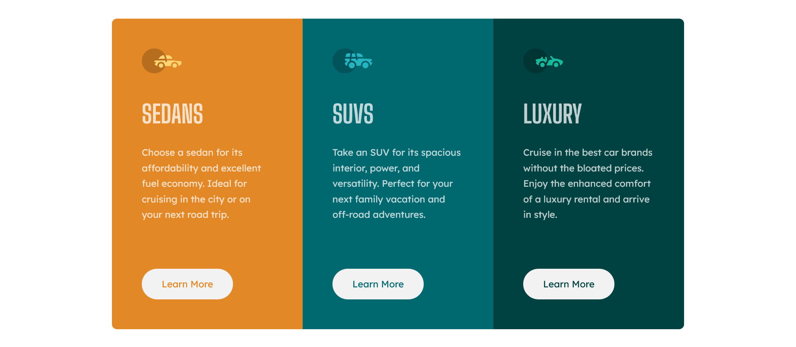

# Frontend Mentor - 3-column preview card component solution

This is a solution to the [3-column preview card component challenge on Frontend Mentor](https://www.frontendmentor.io/challenges/3column-preview-card-component-pH92eAR2-). 

## Table of contents

- [Overview](#overview)
  - [The challenge](#the-challenge)
  - [Screenshot](#screenshot)
- [My process](#my-process)
  - [Built with](#built-with)
  - [What I learned](#what-i-learned)
  - [Continued development](#continued-development)

## Overview

### The challenge

Users should be able to:

- View the optimal layout depending on their device's screen size
- See hover states for interactive elements
- Based on figma mockup and style guide

### Screenshot

## My process

### Built with

- Semantic HTML5 markup
- CSS custom properties
- Flexbox
- CSS Grid
- Desktop-first workflow

### What I learned

- When unique content has to be vertically centered, set <html> and <body> height to 100%.
- For the links I used absolute position within each card in order to have the three of them on the same line (otherwise, when reducing viewport size, due to text overflow the links were not always aligned).
- Apply border-radius to container and overflow set to hidden : a wild border-radius appears !

### Continued development

- I need to work on the effects of height/width : auto, 100%, etc. as it is still a bit confusing sometimes.
- Need to get a better understanding of box-sizing
